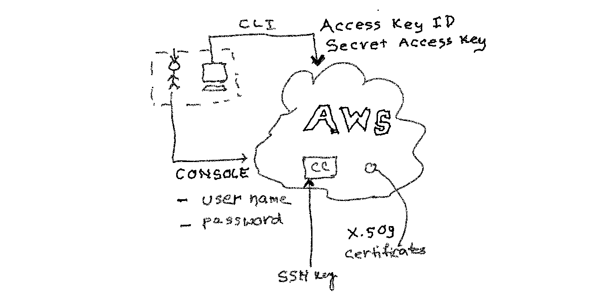

As a beginner's perspective, learning and exploring with the myriad of AWS services is often confusing and frustrating experience. On top of that to get around the IAM concepts is seems like the most daunting task. In this article, I will try to declutter the complexity of IAM concepts using plain English.

To start with, Identity Access Management (IAM) is one of the core services of AWS. Using IAM, you can control who can access to AWS resources. 

## Who is IAM user? 

Whenever we think about users we picture ourselves as Facebook users and we often feel that IAM is somehow related to the creation of end-users and it's management. But this is completely wrong. IAM is nothing to do with managing your end customers who log-in to your website. 

Then what is IAM user for? You can think of yourselves, developers, operation guys and whoever going to manage or interested in your AWS servers or services. Whoever wants to start/stop servers, monitor logs, etc. Also, for yourselves, you can create multiple users when you wear different hats at different times. 

IAM user can be a person or a program. In the following section, let's discuss various ways available to access AWS resources.



### Accessing AWS Console using user name and password

As a starting point, an IAM user using it's user name and password can get access to the AWS console and play around with it. We can associate various permission what this particular user is allowed to do. In the later section, we shall delve into more details on the same.

### Accessing AWS Resources using CLI or programmatically

We can also access AWS resources, not using AWS console but using a command-line interface or programmatically using a shell script or java. To facilitate the access of AWS resources from CLI, we have to generate access key id and secret access key for the IAM user. And we can store the generated access key pairs in `~/.aws/credential` file.

```
➜ cat ~/.aws/credentials
[default]
aws_access_key_id = AKIAI44QH8DHBEXAMPLE
aws_secret_access_key = je7MtGbClwBF/2Zp9Utk/h3yCo8nvbEXAMPLEKEY
```

In OS terminal, we can create AWS related environment variables and store the access key pairs. During AWS CLI command execution, no need to pass access key pairs separately.

```
➜ export AWS_ACCESS_KEY_ID="AKIAI44QH8DHBEXAMPLE"
➜ export AWS_SECRET_ACCESS_KEY="je7MtGbClwBF/2Zp9Utk/h3yCo8nvbEXAMPLEKEY"
```

### Is it possible to access AWS resources using SSH key attached to IAM user?

To access any virtual server usage of the SSH keys is very common. You generate SSH key pairs one is public and another one is private, the private key you keep within your local laptop and copy the public key and store into the remote server. Using this approach you no need to pass credentials each time you want to access the remote server. So you might be thinking, you can copy-paste your public key to a particular IAM user and you should able to access all the ec2 servers you created in the AWS account. But this doesn't work in that fashion. There is no way you can copy-paste the public key to the user level, and the user will become a power user where it can access all the ec2 instances. 

There exist separate EC2 key pair which we can generate and associate with single or multiple ec2 instances for its access. However, we cannot associate the ec2 key pairs to a specific IAM user. 

But if you talk about SSH keys specific to IAM user, there is ***one exception***. To explain the exception, just starts with an example, if you're using GitHub or Bitbucket to access code repository. You need to configure your SSH public key in their server as well. Similarly, to access AWS Code Commit from an IAM user point of view, you need to configure SSH public key to that particular IAM user. There is no need to go to the Code Commit to configure SSH keys.

### Accessing AWS Resources using X.509 Certificates

This is a new mechanism to authenticate a user. It is considered to be more secure than a user name and password or access key-based approach. AWS IoT (Internet of Things) uses this approach. In this case, a private key is stored in the device more securely and you can't copy-paste into another device. This is not a very common way of accessing AWS resources as of today.

## IAM Group

IAM Groups created for ease of maintenance. Instead of granting policies/permission at the individual level, it is more easy and efficient to manage those at a group level. There is no special credentials at the group level and using group you cannot access any AWS resources directly.

## Why we need IAM Role?

To access AWS resources, for example, s3, or RDS or any other AWS resources, we can use access key pairs programmatically for performing API calls.But this is not a recommended way to access any AWS resources, because keys can be viewed in the plain text who has access to the respective EC2 instance.

AWS IAM provides an elegant way to manage permission and provide a secure way of communication, in the form of IAM roles. IAM role is a logical entity created where we can associate desired permission, for example, read or write access to s3, or read-only access to the RDS database, etc. Whenever needed, an IAM user or a group or ec2 instance can assume the IAM role and hence it has the privilege to do that operation. And, and it can do without storing or worry about the credential.


### How to assume an IAM role?

Applications or AWS services such as EC2 can assume an IAM role by calling AWS Security Token Service (STS) AssumeRole APIs. These API will return a set of temporary credentials which are valid for a certain duration. An application can use those temporary credentials to perform any desired operation on target resources such as S3. We will discuss this in detail in another article.

### AWS service role for an EC2 instance

It is possible to store access keys as described earlier and the application can use those credentials when needed. However, it is not a secure practice to store keys in plain text and like a password, we should change in a timely manner, access keys also should be changed. 

We can create an IAM role with desired permission and attach it to EC2 instance. Application inside the EC2 can retrieve the temporary credentials whenever it makes API calls using the AWS SDK. No need to write additional code to retrieve the credentials and store it separately.


## Recommendation: DO NOT use root user in day to day activity

Whenever you create an AWS account using your email address and your credit card details, then you ideally create an AWS root user, which is extremely powerful. And it is possible to create access key id and secret key for the same, but it is not recommended to generate and use it. It's recommended to create another user and use it accordingly. Sometime the novice or the beginner users will use their root user for doing any operation or for the learning purposes. However, it is recommended not to use your root user because it can have catastrophic consequences if credentials compromised. It is advisable to create a strong password and enable multi-factor authentication(MFA). I'll discuss multi-factor authentication later. 

## Global vs Regional

One important thing to remember is that the IAM service is available globally. Usually, most of the AWS services available to specific regions that you selected. On the other hand, even though you have multiple regions, you will have to manage IAM in one place. This means users, groups, roles created in IAM will be available to all-region.


## Tips

- It's not mandatory to use email as a user name. You can use any sensible string as a user name as long as they are unique inside an account.

- Each Amazon resource has a unique ID (alphanumeric) associated with it. This unique id is known as ARN(Amazon Resource Name). Each IAM user has its ARN. We can use this ARN to be more specific while giving permissions or in API calls.

```
arn:aws:iam::account-id:user/user-name-with-path
arn:aws:iam::123456789012:user/Steve
```

*Hope you enjoy reading this article. I am planning to create similar articles on AWS and various programming topics. Appreciate it if you can leave your feedback below. Stay tuned for future updates!*